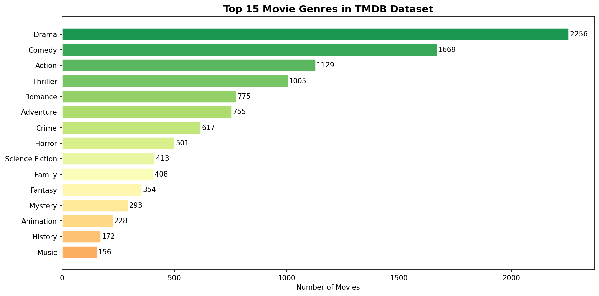
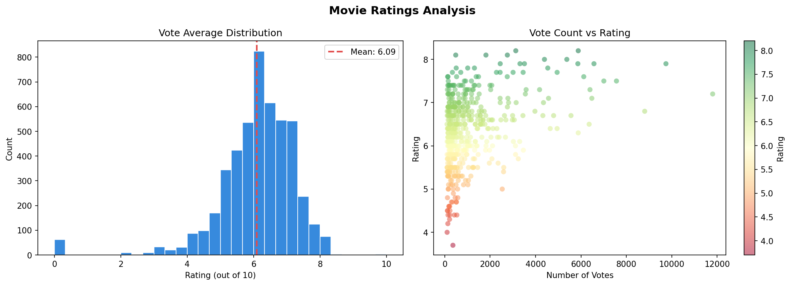
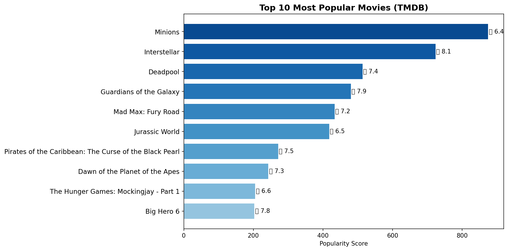
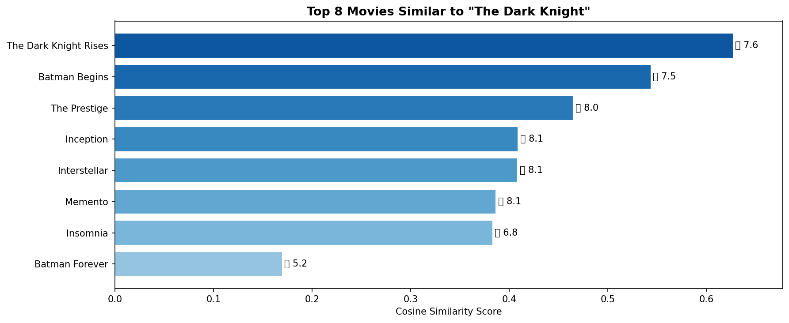
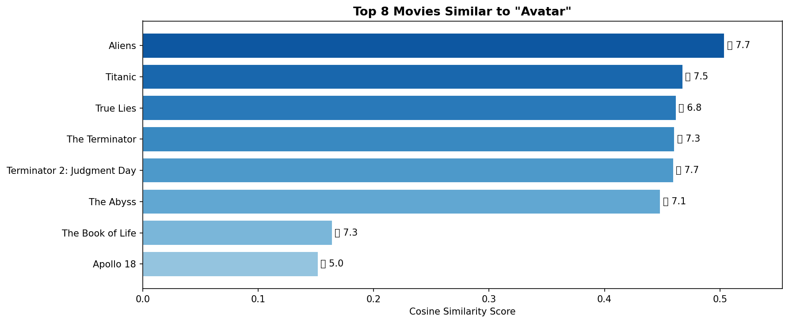

# 🎬 Movie Recommendation System


A content-based movie recommendation system built using TF-IDF vectorization and Cosine Similarity on the TMDB 5000 Movies dataset.

---

## 🚀 How It Works

1. **Feature Extraction** — Extracts genres, cast, director, keywords & overview from each movie
2. **Tag Building** — Combines all features into a single "tag soup" string per movie
3. **TF-IDF Vectorization** — Converts tags into a 5000-feature numerical matrix
4. **Cosine Similarity** — Measures similarity between all movie pairs
5. **Recommendation** — Returns top-N most similar movies for any given input

---

## 📊 Dataset
- **Source:** [TMDB 5000 Movies — Kaggle](https://www.kaggle.com/datasets/tmdb/tmdb-movie-metadata)
- **Size:** 4,803 movies
- **Features used:** genres, cast, director, keywords, overview

---

## 🔍 EDA Highlights

### Top Genres


### Rating Distribution


### Most Popular Movies


---

## 🤖 Recommendation Examples

### Similar to "The Dark Knight"


### Similar to "Avatar"


---

## ⚙️ Feature Engineering
| Feature | Weight | Description |
|---------|--------|-------------|
| Genres | 1x | Action, Drama, Comedy etc. |
| Keywords | 1x | Thematic tags |
| Cast | 1x | Top 3 actors |
| Director | 3x | Weighted higher for stronger influence |
| Overview | 1x | First 20 words of plot summary |

---

## 🗂️ Project Structure
```
movie-recommendation-system/
├── movie_recommendation_system.ipynb
├── movie_rec_project/
│   ├── tfidf_vectorizer.pkl
│   ├── cosine_sim.pkl
│   ├── movies_clean.csv
│   └── movie_titles.json
├── eda_genres.png
├── eda_ratings.png
├── eda_popular.png
├── rec_the_dark_knight.png
├── rec_avatar.png
└── README.md
```

## 🚀 How to Run
1. Clone this repo
2. Open `movie_recommendation_system.ipynb` in Google Colab
3. Run all cells top to bottom
4. Use the interactive dropdown to get recommendations!

## 🛠️ Tech Stack
- Python 3.10
- Pandas, NumPy, Matplotlib, Seaborn
- Scikit-Learn (TF-IDF, Cosine Similarity)
- ipywidgets (Interactive UI)

## 👤 Author
**Your Name** — [GitHub](https://github.com/yourusername) | [LinkedIn](https://linkedin.com/in/yourusername)
